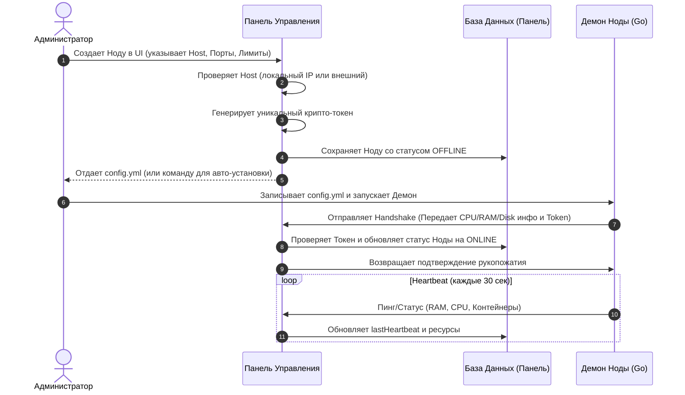

# Архитектура интеграции Нод (Nodes) — Аналог RemnaWave / Pterodactyl

Этот документ описывает подробную архитектуру, бизнес-логику и примеры реализации для добавления и управления нодами (Nodes/серверами) в панели управления.

---

## 1. Схема базы данных (Database Schema)

Ниже представлена структура сущности `Node` для СУБД (на примере Prisma Schema).

```prisma
model Node {
  id             String     @id @default(uuid())
  name           String     @unique
  
  // Сетевые настройки
  host           String     // Внешний IP или домен для клиентов (например, node1.panel.com)
  internalHost   String     @default("127.0.0.1") // Внутренний IP для связи Панель -> Нода
  port           Int        @default(8080)        // Порт API Демона
  sftpPort       Int        @default(2022)        // Порт встроенного SFTP-сервера
  isLocal        Boolean    @default(false)       // Флаг локальной установки (на одном сервере с панелью)
  
  // Безопасность
  token          String     // Уникальный криптографический ключ ноды (API Token/Secret)
  
  // Ресурсы
  ramLimit       BigInt     // Макс. оперативная память (в байтах), доступная для контейнеров
  cpuLimit       Int        @default(100)         // Максимальное количество выделяемых CPU-ядер (в %)
  diskLimit      BigInt     // Макс. дисковое пространство (в байтах)
  
  // Статус и мониторинг
  status         NodeStatus @default(OFFLINE)
  lastHeartbeat  DateTime?
  createdAt      DateTime   @default(now())
  updatedAt      DateTime   @updatedAt
}

enum NodeStatus {
  ONLINE
  OFFLINE
  ERROR
  MAINTENANCE
}
```

---

## 2. Пошаговый Алгоритм (Workflow)



### Шаг 1: Создание ноды в UI панели
Администратор заполняет форму (Название, Host/IP, лимиты RAM/CPU/Disk). 
- Панель валидирует хост. Если введен локальный IP (`localhost`, `127.0.0.1`) или внешний IP сервера совпадает с IP панели, система автоматически выставляет флаг `isLocal = true` и устанавливает `internalHost = "127.0.0.1"`.
- Генерируется криптографически стойкий токен (например, `crypto.randomBytes(32).toString('hex')`).

### Шаг 2: Генерация конфигурационного файла (`config.yml`)
Панель отдает готовый YAML-конфиг, который демон использует при старте:
```yaml
# config.yml
node:
  id: "d8a1723f-e155-4a66-f61a-47c383e5d7f7"
  token: "87c4f1a23b9d0e12f345678a9bcde01f23456789abcdef0123456789abcdef01"
  port: 8080
  sftp_port: 2022
  is_local: true
panel:
  url: "https://panel.myhosting.com"
  # Если нода локальная, демон отключает строгую проверку SSL при запросах к панели
  allow_self_signed_ssl: true
```

### Шаг 3: Процесс рукопожатия (Handshake) и Heartbeat
При запуске демон ноды:
1. Загружает `config.yml`.
2. Запускает встроенный веб-сервер API (на порту `8080`) и SFTP (на порту `2022`).
3. Отправляет POST-запрос на Панель `/api/v1/nodes/handshake` с токеном авторизации.
4. Панель подтверждает токен, опрашивает API демона для проверки доступности со своей стороны и меняет статус ноды на `ONLINE`.

---

## 3. Пример реализации

### А. Код Панели (Node.js/TypeScript)

Эндпоинт создания ноды и проверка локального хоста:

```typescript
// panel/src/controllers/node.controller.ts
import { Request, Response } from 'express';
import crypto from 'crypto';
import dns from 'dns/promises';
import { getPrisma } from '../lib/prisma';

// 1. Валидация хоста (локальный/внешний)
async function isLocalHost(host: string): Promise<boolean> {
  const localIPs = ['127.0.0.1', 'localhost', '::1', '0.0.0.0'];
  if (localIPs.includes(host)) {
    return true;
  }

  try {
    // Разрешаем доменное имя в IP
    const addresses = await dns.resolve(host).catch(() => []);
    if (addresses.some(ip => localIPs.includes(ip))) {
      return true;
    }

    // Сравниваем с внешним IP самого сервера панели
    const myExternalIP = process.env.SERVER_IP || '127.0.0.1';
    if (addresses.includes(myExternalIP) || host === myExternalIP) {
      return true;
    }
  } catch (e) {
    // В случае ошибок DNS считаем хост внешним
  }
  return false;
}

// 2. Создание ноды
export async function createNode(req: Request, res: Response) {
  try {
    const { name, host, port, sftpPort, ramLimit, cpuLimit, diskLimit } = req.body;
    const prisma = getPrisma();

    // Проверка на конфликты портов при локальной установке
    const isLocal = await isLocalHost(host);
    if (isLocal) {
      const forbiddenPorts = [80, 443, parseInt(process.env.API_PORT || '3000')];
      if (forbiddenPorts.includes(port) || forbiddenPorts.includes(sftpPort)) {
        return res.status(400).json({ error: 'Port conflict with panel services on Localhost' });
      }
    }

    const token = crypto.randomBytes(32).toString('hex');

    const node = await prisma.node.create({
      data: {
        name,
        host,
        internalHost: isLocal ? '127.0.0.1' : host,
        port: port || 8080,
        sftpPort: sftpPort || 2022,
        isLocal,
        token,
        ramLimit: BigInt(ramLimit),
        cpuLimit: cpuLimit || 100,
        diskLimit: BigInt(diskLimit),
        status: 'OFFLINE',
      }
    });

    res.status(201).json({
      node,
      configYml: `
node:
  id: "${node.id}"
  token: "${token}"
  port: ${node.port}
  sftp_port: ${node.sftpPort}
  is_local: ${isLocal}
panel:
  url: "${process.env.PANEL_URL || 'http://127.0.0.1:3000'}"
  allow_self_signed_ssl: ${isLocal}
`
    });
  } catch (error: any) {
    res.status(500).json({ error: error.message });
  }
}
```

### Б. Код Демона (Go)

Демон на Go считывает конфигурацию, настраивает HTTPS-клиент (отключает проверку SSL для локальных запросов, если разрешено) и шлет статус в панель:

```go
// daemon/main.go
package main

import (
	"bytes"
	"crypto/tls"
	"encoding/json"
	"fmt"
	"io"
	"log"
	"net/http"
	"os"
	"time"

	"gopkg.in/yaml.v3"
)

type Config struct {
	Node struct {
		ID       string `yaml:"id"`
		Token    string `yaml:"token"`
		Port     int    `yaml:"port"`
		SFTPPort int    `yaml:"sftp_port"`
		IsLocal  bool   `yaml:"is_local"`
	} `yaml:"node"`
	Panel struct {
		URL                string `yaml:"url"`
		AllowSelfSignedSSL bool   `yaml:"allow_self_signed_ssl"`
	} `yaml:"panel"`
}

type HeartbeatPayload struct {
	NodeID   string  `json:"nodeId"`
	CPUUsage float64 `json:"cpuUsage"`
	RAMUsage int64   `json:"ramUsage"`
}

func main() {
	// 1. Загрузка конфигурации
	configFile, err := os.ReadFile("config.yml")
	if err != nil {
		log.Fatalf("Error reading config file: %v", err)
	}

	var cfg Config
	if err := yaml.Unmarshal(configFile, &cfg); err != nil {
		log.Fatalf("Error parsing config: %v", err)
	}

	// 2. Настройка HTTP-клиента с поддержкой локального SSL
	tr := &http.Transport{
		TLSClientConfig: &tls.Config{
			InsecureSkipVerify: cfg.Panel.AllowSelfSignedSSL,
		},
	}
	client := &http.Client{
		Transport: tr,
		Timeout:   10 * time.Second,
	}

	log.Printf("Daemon initialized. Connecting to Panel: %s", cfg.Panel.URL)

	// 3. Запуск Heartbeat цикла
	ticker := time.NewTicker(30 * time.Second)
	defer ticker.Stop()

	// Первый пинг при запуске
	sendHeartbeat(client, &cfg)

	for range ticker.C {
		sendHeartbeat(client, &cfg)
	}
}

func sendHeartbeat(client *http.Client, cfg *Config) {
	url := fmt.Sprintf("%s/api/v1/nodes/heartbeat", cfg.Panel.URL)

	payload := HeartbeatPayload{
		NodeID:   cfg.Node.ID,
		CPUUsage: 12.5,       // Реальный сбор метрик
		RAMUsage: 4294967296, // 4GB в байтах
	}

	jsonData, err := json.Marshal(payload)
	if err != nil {
		log.Printf("Error marshalling heartbeat: %v", err)
		return
	}

	req, err := http.NewRequest("POST", url, bytes.NewBuffer(jsonData))
	if err != nil {
		log.Printf("Error creating request: %v", err)
		return
	}

	req.Header.Set("Content-Type", "application/json")
	req.Header.Set("Authorization", "Bearer "+cfg.Node.Token)

	resp, err := client.Do(req)
	if err != nil {
		log.Printf("Heartbeat failed (connection error): %v", err)
		return
	}
	defer resp.Body.Close()

	if resp.StatusCode != http.StatusOK {
		body, _ := io.ReadAll(resp.Body)
		log.Printf("Heartbeat rejected by Panel (HTTP %d): %s", resp.StatusCode, string(body))
		return
	}

	log.Println("Heartbeat successfully sent to Panel. Node status: ONLINE")
}
```
